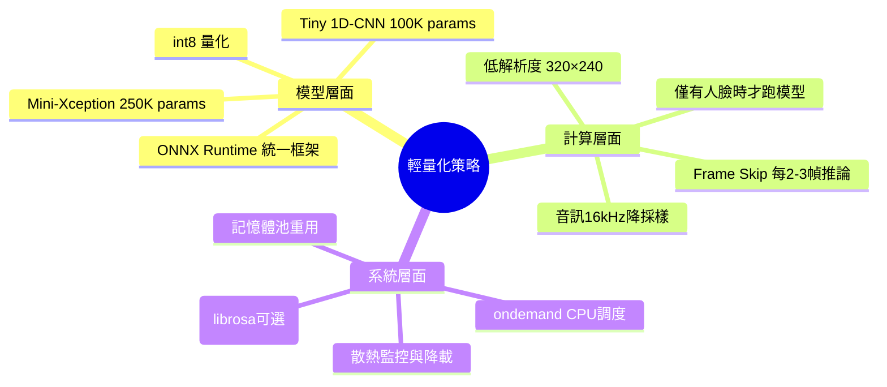
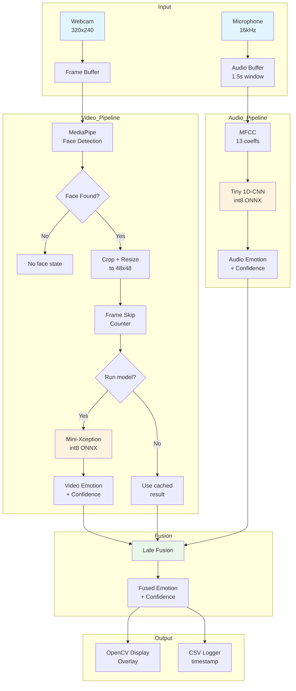
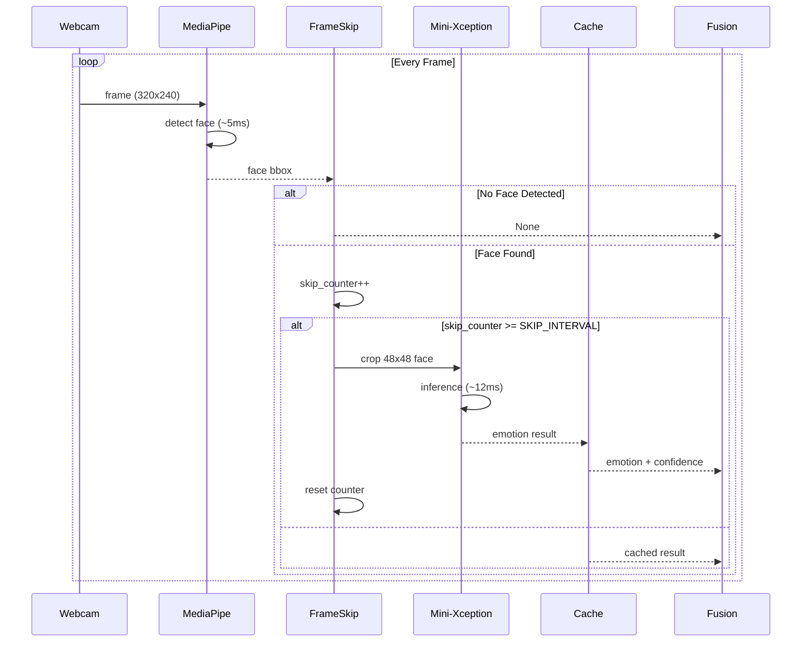
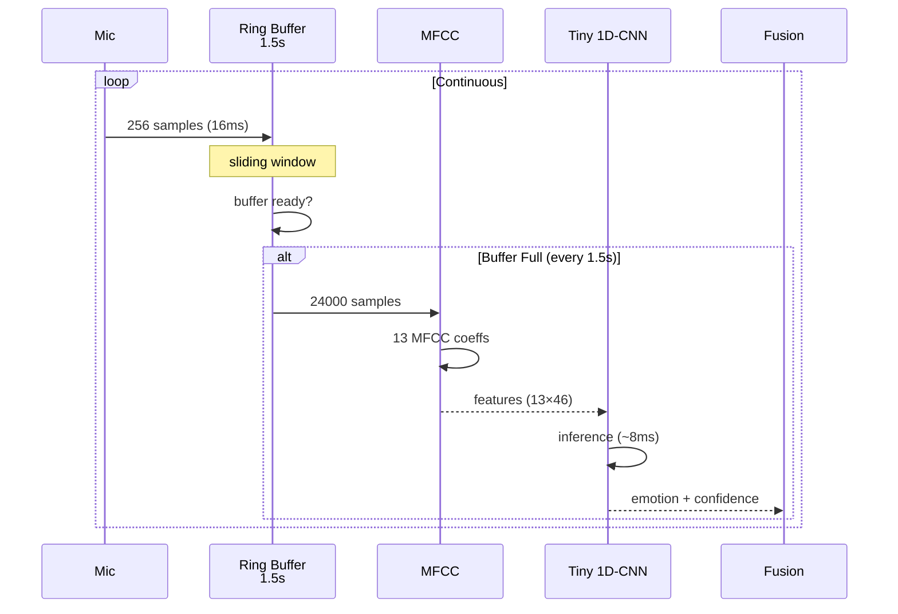
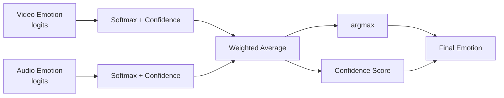
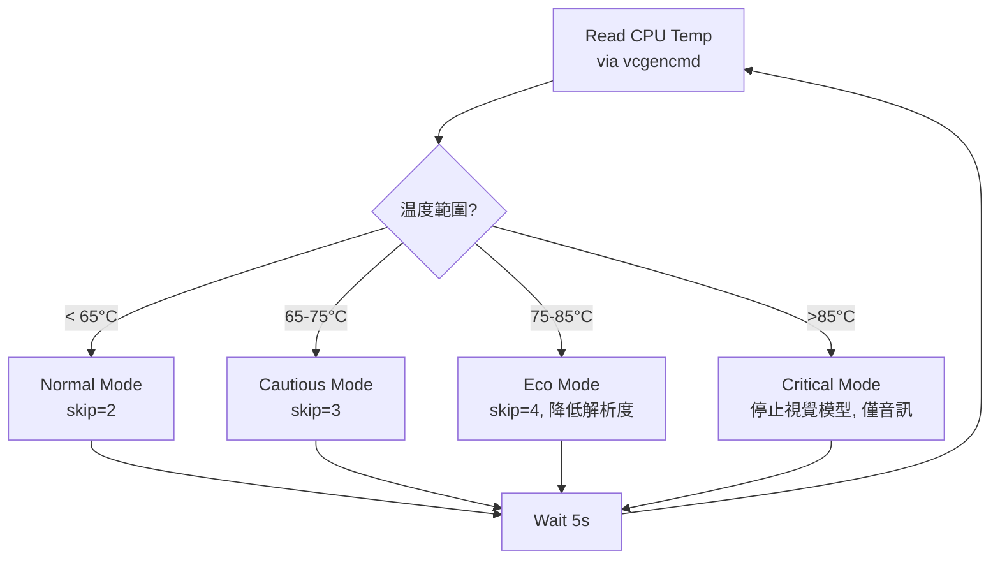
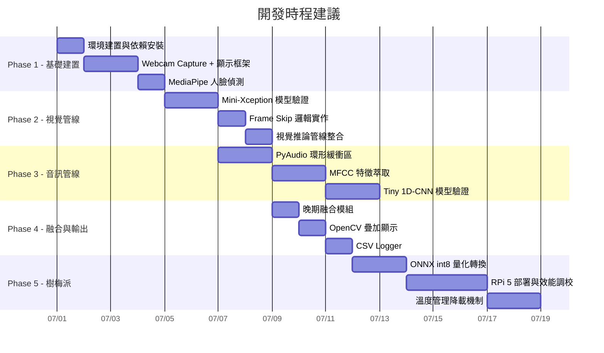

# 多模態情緒辨識系統 — 輕量化設計文件

> 基於麥克風 + 即時影像，本地端與樹梅派 5 皆可執行，以低功耗輕量化為核心設計目標。

---

## 目錄

1. [系統概述](#1-系統概述)
2. [輕量化設計原則](#2-輕量化設計原則)
3. [系統架構](#3-系統架構)
4. [視覺管線](#4-視覺管線)
5. [音訊管線](#5-音訊管線)
6. [晚期融合](#6-晚期融合)
7. [輸出顯示與紀錄](#7-輸出顯示與紀錄)
8. [樹梅派 5 部署](#8-樹梅派-5-部署)
9. [專案目錄結構](#9-專案目錄結構)
10. [開發順序](#10-開發順序)
11. [效能預估](#11-效能預估)

---

## 1. 系統概述

### 功能

- 透過 **Webcam** 即時偵測人臉並辨識表情（4 類情緒）
- 透過 **麥克風** 即時分析語調情緒
- **晚期融合** 兩個模態結果，輸出最終情緒判斷
- **即時顯示**（OpenCV 疊加）+ **CSV 紀錄**

### 情緒類別

| 編號 | 情緒 | 說明 |
|------|------|------|
| 0 | Neutral | 中性/平靜 |
| 1 | Happy | 快樂 |
| 2 | Sad | 悲傷 |
| 3 | Anger | 生氣 |

### 技術堆疊

| 元件 | PC 端 | 樹梅派 5 |
|------|-------|-----------|
| 推論引擎 | ONNX Runtime | ONNX Runtime (XNNPACK EP) |
| 人臉偵測 | MediaPipe Face Detection | MediaPipe (TFLite) |
| 視覺模型 | Mini-Xception (ONNX, int8) | Mini-Xception (ONNX, int8) |
| 音訊模型 | Tiny 1D-CNN (ONNX, int8) | Tiny 1D-CNN (ONNX, int8) |
| 音訊擷取 | PyAudio (16kHz) | PyAudio (16kHz) |
| 視訊擷取 | OpenCV (320×240) | OpenCV (320×240) |

---

## 2. 輕量化設計原則



### 2.1 模型量化

所有 ONNX 模型皆轉換為 **int8 量化** 格式：
- 體積縮小 **4 倍**
- 推論速度提升 **2-3 倍**（ARM NEON 指令集加速）
- 準確度損失 < 1-2%

### 2.2 Frame Skip 策略

```
Frame N     : Face Detect + Emotion Model → 結果 A
Frame N+1   : Face Detect only → 沿用結果 A
Frame N+2   : Face Detect only → 沿用結果 A
Frame N+3   : Face Detect + Emotion Model → 結果 B
```

> 溫度 > 75°C 時自動擴張為 skip 4 frame

### 2.3 計算管線分離

```
┌─────────────────────────────────────────────┐
│                  Main Loop                    │
│  ┌──────────────┐    ┌──────────────────┐    │
│  │ Video Thread  │    │  Audio Thread    │    │
│  │ 15+ FPS loop  │    │  every 1.5s     │    │
│  └──────┬───────┘    └───────┬──────────┘    │
│         │                    │                │
│         ▼                    ▼                │
│  ┌──────────────────────────────────┐        │
│  │         Fusion Module            │        │
│  │  confidence-based weighted avg   │        │
│  └──────────────┬───────────────────┘        │
│                 ▼                            │
│  ┌──────────────────────────────────┐        │
│  │      Display + Logger            │        │
│  └──────────────────────────────────┘        │
└─────────────────────────────────────────────┘
```

---

## 3. 系統架構



---

## 4. 視覺管線

### 4.1 流程圖



### 4.2 模型架構：Mini-Xception

```
Input: 48x48 Grayscale
│
├─ Conv2D 32, 3×3 → BN → ReLU
├─ SeparableConv2D 32, 3×3 → BN → ReLU
├─ MaxPooling 2×2
├─ SeparableConv2D 64, 3×3 → BN → ReLU
├─ MaxPooling 2×2
├─ SeparableConv2D 128, 3×3 → BN → ReLU
├─ MaxPooling 2×2
├─ SeparableConv2D 256, 3×3 → BN → ReLU
├─ GlobalAveragePooling
├─ Dropout 0.5
└─ Dense 4 → Softmax
```

| 屬性 | 數值 |
|------|------|
| 參數量 | ~250,000 |
| 輸入尺寸 | 48×48×1 |
| 推論時間 (RPi5) | ~10-15ms (int8) |
| 推論時間 (PC) | ~1-2ms |

### 4.3 人臉偵測：MediaPipe Face Detection

- 基於 **BlazeFace** 模型（~200K params）
- 輸入：320×240 RGB
- 輸出：邊界框 + 6 個關鍵點
- RPi 5 耗時：**~5ms/幀**

---

## 5. 音訊管線

### 5.1 流程圖



### 5.2 音訊特徵：MFCC

| 參數 | 數值 |
|------|------|
| 採樣率 | 16,000 Hz |
| 幀長 | 512 samples (32ms) |
| 移位 | 256 samples (16ms) |
| MFCC 係數 | 13 |
| 時間幀數 | ~92 幀 / 1.5s |
| 特徵維度 | 13 × 92 |

### 5.3 模型架構：Tiny 1D-CNN

```
Input: 13 × 92 (MFCC)
│
├─ Conv1D 32, kernel=5, stride=2 → BN → ReLU
├─ Conv1D 64, kernel=3, stride=2 → BN → ReLU
├─ GlobalAveragePooling 1D
├─ Dense 64 → ReLU
├─ Dropout 0.3
└─ Dense 4 → Softmax
```

| 屬性 | 數值 |
|------|------|
| 參數量 | ~100,000 |
| 輸入尺寸 | 13×92 |
| 推論時間 (RPi5) | ~5-8ms (int8) |
| 推論時間 (PC) | <1ms |

---

## 6. 晚期融合



### 6.1 融合公式

```
confidence_v = max(softmax(video_logits))
confidence_a = max(softmax(audio_logits))

w_v = confidence_v / (confidence_v + confidence_a + ε)
w_a = confidence_a / (confidence_v + confidence_a + ε)

fused_logits = w_v × video_logits + w_a × audio_logits
final_emotion = argmax(fused_logits)
```

### 6.2 特殊情況處理

| 情況 | 策略 |
|------|------|
| 無人臉 | 僅使用音訊結果 |
| 音訊無結果（初始化） | 僅使用視覺結果 |
| 兩者信心度皆低 (<0.3) | 輸出 Neutral |
| 兩者衝突（信心接近） | 輸出兩者 + 標示 ambiguous |

---

## 7. 輸出顯示與紀錄

### 7.1 OpenCV 顯示佈局

```
┌──────────────────────────────────┐
│  [Webcam Feed]                   │
│                                  │
│        ┌──────────┐              │
│        │ Face     │              │
│        │ [Happy]  │              │
│        │ 87.3%    │              │
│        └──────────┘              │
│                                  │
│  ┌──────────────────────────┐   │
│  │ Audio: Neutral  62.1%   │   │
│  │ Fused: Happy    74.5%   │   │
│  │ FPS: 16 | Temp: 62°C   │   │
│  └──────────────────────────┘   │
└──────────────────────────────────┘
```

### 7.2 CSV 日誌格式

```csv
timestamp,face_detected,video_emotion,video_conf,audio_emotion,audio_conf,fused_emotion,fused_conf,fps,cpu_temp
2026-06-29 14:30:01.123,True,happy,0.873,neutral,0.621,happy,0.745,16.2,62.5
2026-06-29 14:30:01.187,True,happy,0.891,neutral,0.598,happy,0.763,15.8,62.8
```

---

## 8. 樹梅派 5 部署

### 8.1 硬體規格參考

| 項目 | 數值 |
|------|------|
| CPU | Quad Cortex-A76 @ 2.4GHz |
| RAM | 4GB / 8GB LPDDR4X |
| 散熱建議 | Heatsink + 5V 風扇（必備） |
| 熱降頻閾值 | 85°C |
| 建議運行溫度 | < 70°C |

### 8.2 系統調校

```bash
# CPU 調度模式 (ondemand 比 performance 省電)
sudo cpufreq-set -g ondemand

# 關閉不必要的服務
sudo systemctl disable bluetooth
sudo systemctl disable triggerhappy

# 限制 GPU 記憶體 (不使用桌面環境)
# 在 /boot/firmware/config.txt 中設定:
# gpu_mem=64

# 降低 CPU 最高頻率 (溫度過高時)
# sudo cpufreq-set -u 1.8GHz
```

### 8.3 溫度管理機制



### 8.4 ONNX Runtime 設定

```python
import onnxruntime as ort

# RPi 5: XNNPACK Execution Provider (ARM NEON 優化)
options = ort.SessionOptions()
options.intra_op_num_threads = 2
options.inter_op_num_threads = 1
options.graph_optimization_level = ort.GraphOptimizationLevel.ORT_ENABLE_ALL

# 優先使用 XNNPACK EP
providers = [
    ("XNNPACKExecutionProvider", {"intra_op_num_threads": 2}),
    "CPUExecutionProvider",
]

session = ort.InferenceSession("model_int8.onnx", options, providers=providers)
```

---

## 9. 專案目錄結構

```
Multimodal-Recognition/
├── config/
│   └── config.yaml              # 所有可調參數
├── src/
│   ├── main.py                  # 主入口
│   ├── audio/
│   │   ├── __init__.py
│   │   ├── capture.py           # PyAudio 擷取 + 環形緩衝
│   │   ├── features.py          # MFCC 特徵萃取
│   │   ├── model.py             # 模型載入 + 推論
│   │   └── inference.py         # 音訊推論管線
│   ├── video/
│   │   ├── __init__.py
│   │   ├── capture.py           # OpenCV 相機擷取
│   │   ├── face_detection.py    # MediaPipe 人臉偵測
│   │   ├── model.py             # Mini-Xception 載入 + 推論
│   │   └── inference.py         # 視覺推論管線 (含 frame skip)
│   ├── fusion/
│   │   ├── __init__.py
│   │   └── late_fusion.py       # 信心度加權融合
│   └── output/
│       ├── __init__.py
│       ├── display.py           # OpenCV 疊加顯示
│       └── logger.py            # CSV 紀錄
├── models/                      # ONNX 模型權重
│   └── .gitkeep
├── data/
│   └── logs/                    # 輸出 CSV 日誌
│       └── .gitkeep
├── scripts/
│   ├── download_models.py       # 下載預訓練模型
│   ├── train_audio.py           # 訓練音訊模型
│   └── train_video.py           # 訓練視覺模型
├── ARCHITECTURE.md              # 本文件
├── requirements.txt             # PC 依賴
└── requirements_rpi.txt         # RPi 5 依賴
```

---

## 10. 開發順序



---

## 11. 效能預估

### 11.1 推論延遲

| 模組 | PC (i5-12th) | RPi 5 (無風扇) | RPi 5 (有風扇) |
|------|:------------:|:--------------:|:--------------:|
| MediaPipe 人臉偵測 | ~2ms | ~5ms | ~5ms |
| Mini-Xception (int8) | ~1ms | ~12ms | ~10ms |
| Tiny 1D-CNN (int8) | <0.5ms | ~6ms | ~5ms |
| MFCC 萃取 | <1ms | ~15ms | ~12ms |

### 11.2 系統 FPS

| 模式 | PC | RPi 5 (無風扇) | RPi 5 (有風扇) |
|------|:--:|:--------------:|:--------------:|
| Normal (skip=2) | 30+ | 10-12 | 15-18 |
| Cautious (skip=3) | 30+ | 12-15 | 18-22 |
| Eco (skip=4) | 30+ | 15-18 | 22-25 |

### 11.3 預估功耗

| 狀態 | RPi 5 功耗 | 溫度 |
|------|:----------:|:----:|
| Idle | ~2.5W | ~45°C |
| 正常運行 (有風扇) | ~6-8W | ~60-65°C |
| 正常運行 (無風扇) | ~6-8W | ~75-80°C |
| Eco 模式 (無風扇) | ~4-5W | ~65-70°C |

---

## 附錄 A：config.yaml 設定檔範例

```yaml
system:
  mode: "local"           # local | rpi
  log_level: "INFO"

video:
  camera_id: 0
  width: 320
  height: 240
  fps_target: 15
  frame_skip: 2           # 每 N 幀跑一次模型
  face_detection:
    min_detection_confidence: 0.7
    model_selection: 0     # 0=近距離, 1=遠距離
  model:
    path: "models/mini_xception_int8.onnx"
    input_size: 48
    input_channels: 1       # grayscale

audio:
  sample_rate: 16000
  chunk_size: 256
  device_id: -1            # -1 = default
  window_seconds: 1.5
  mfcc:
    n_mfcc: 13
    n_fft: 512
    hop_length: 256
  model:
    path: "models/tiny_cnn_audio_int8.onnx"

fusion:
  method: "confidence_weighted"
  fallback_emotion: "neutral"

output:
  display:
    show_video: true
    show_audio: true
    show_fused: true
    show_fps: true
    show_temp: true        # RPi 專用
  csv_log:
    enabled: true
    path: "data/logs/session_{timestamp}.csv"

thermal:                  # RPi 專用
  check_interval: 5       # 秒
  thresholds:
    cautious: 65
    eco: 75
    critical: 85
```

## 附錄 B：requirements.txt

```txt
# PC 端開發用
opencv-python>=4.8.0
mediapipe>=0.10.0
onnxruntime>=1.16.0
pyaudio>=0.2.11
numpy>=1.24.0
pyyaml>=6.0
librosa>=0.10.0
soundfile>=0.12.0
```

```txt
# requirements_rpi.txt (樹梅派精簡版)
opencv-python-headless>=4.8.0
mediapipe>=0.10.0
onnxruntime>=1.16.0
pyaudio>=0.2.11
numpy>=1.24.0
pyyaml>=6.0
# 自行實作 MFCC 以移除 librosa 依賴
```

---

> 本文件對應專案：[Multimodal-Recognition](https://github.com/anomalyco/Multimodal-Recognition)
